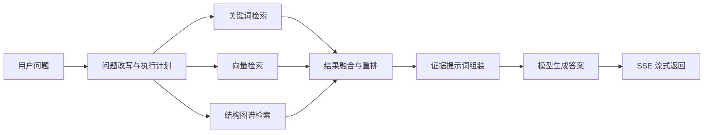
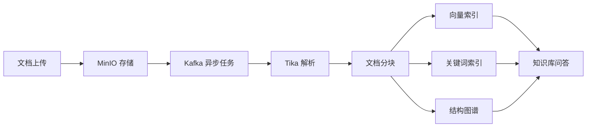

# KnowHub AI

KnowHub AI 是一个面向企业知识库问答与 Agent 编排的 Java 17 / Spring Boot 3.5 项目。后端采用 Maven 多模块组织，前端使用独立 Vue 应用，统一使用 `ai.knowhub` 包名、`/api/v1` API 版本前缀，以及 `Dto` / `Vo` / `View.vue` 命名规范。

本项目的重点是后端知识库问答能力：文档接入、异步解析、知识索引、混合检索、结构图谱、RAG 编排、Agent 工具调用和流式对话响应。

## 后端架构

后端是 KnowHub AI 的核心。模块之间按照"基础能力 -> 领域能力 -> 可执行应用"的方向组织，避免把认证、文档、对话、基础设施混在单个模块中。

| 模块 | 职责 |
| --- | --- |
| `knowhub-common` | 统一响应、异常、枚举、Web 工具、MyBatis 辅助、API 版本常量 |
| `knowhub-infra` | Redis、Redisson、分布式锁、租约、百度 UID 集成 |
| `knowhub-auth` | 管理端认证、JWT、预览模式写保护 |
| `knowhub-document` | 文档上传、解析、分块、异步处理、检索索引、知识库管理、MinIO、Kafka、PGVector、Elasticsearch、Neo4j、Milvus 配置 |
| `knowhub-chat` | 对话接口、RAG 编排、Agent 执行、工具调用、检索观察、SSE 流式响应 |
| `knowhub-app` | Spring Boot 启动应用、运行时配置、模块装配 |

后端入口统一通过 `knowhub-app` 启动，业务能力由各模块提供 Spring Bean。跨模块复用优先放在 `knowhub-common` 和 `knowhub-infra`，领域逻辑保持在对应业务模块中。

## Agent 技能

KnowHub AI 的 Agent 能力位于 `knowhub-chat` 模块，核心目标不是简单问答，而是根据问题、上下文、知识库状态和可用工具选择合适执行策略。

### 执行策略

系统通过 `ConversationExecutorRegistry` 管理不同执行器，按场景选择一种对话执行路径：

| 执行器 | Agent 技能 |
| --- | --- |
| `ReactAgentExecutor` | ReAct 风格的自主推理与工具调用，适合需要搜索、规划和多步处理的问题 |
| `RagChatExecutor` | 标准知识库 RAG，对用户问题进行改写、检索、重排和答案组装 |
| `GraphOnlyExecutor` | 仅基于结构图谱回答，适合目录、章节、实体关系、结构性知识导航 |
| `GraphThenEvidenceExecutor` | 先用图谱定位知识范围，再回到证据片段生成答案 |
| `ClarificationExecutor` | 当问题缺少知识库、文档范围或意图信息时，主动生成澄清问题 |

这些执行器共享会话上下文、模型调用配置、检索配置和 SSE 输出通道，因此可以在统一 API 下暴露不同 Agent 技能。

### 工具技能

Agent 可以调用外部工具增强回答能力。当前集成的核心工具包括：

- Tavily 搜索工具：用于补充知识库之外的网络信息。
- 工具入参兜底拦截：当模型生成的工具参数不完整时，自动尝试从上下文中补全。
- 模型调用预算控制：限制单轮 Agent 的最大调用次数、最大工具调用次数和最大执行步数。
- 错误恢复策略：工具调用失败时返回可解释错误，并尽量让 Agent 继续完成回答。
- 流式事件输出：通过 SSE 输出回答内容、思考阶段、检索证据、工具结果和调试轨迹。

### 记忆与上下文

对话过程会结合历史消息、用户问题和知识库配置生成执行计划。核心能力包括：

- 历史上下文压缩，避免长对话无限增长。
- 问题改写，将口语化追问转换成适合检索的独立问题。
- 子问题拆分，支持复杂问题的多跳检索。
- 规划上下文构造，为 Agent 提供知识库、文档和工具约束。
- 无证据兜底，当检索结果不足时避免伪造来源。

## RAG 能力

KnowHub AI 的 RAG 不是单一向量检索，而是组合了关键词、向量、图谱和重排的混合检索流程。



核心 RAG 技能包括：

- 查询改写：将上下文追问改写为可独立检索的问题。
- 多通道检索：同时支持关键词、向量和图谱检索。
- 检索融合：合并不同通道的候选片段，控制相似度阈值和 TopK。
- 重排处理：支持 HTTP rerank 后处理。
- 证据组装：将命中的文档片段、标题、章节和来源整理成模型提示词。
- 来源输出：回答中保留可追踪的证据引用。
- 图谱增强：通过 Neo4j 或 MySQL 结构图谱辅助文档导航。

检索与存储技术方案包括 MySQL、PostgreSQL pgvector、Elasticsearch、Redis、Kafka、MinIO、Milvus 和 Neo4j。

## 文档处理能力

文档模块负责把原始文件转化为可检索、可追踪、可被 Agent 使用的知识资产。



文档后端能力包括：

- 文件上传与对象存储：通过 MinIO 保存原始文件。
- 异步处理流水线：通过 Kafka 解耦上传、解析、分块和索引。
- 文档解析：使用 Tika 提取文档文本。
- 分块策略：支持递归分块、语义分块和模型推荐分块。
- 结构节点：抽取文档标题、章节、段落和层级关系。
- 关键词索引：使用 Elasticsearch 支持文档导航与关键词召回。
- 向量索引：支持 PostgreSQL pgvector，并保留 Milvus 配置。
- 图谱投影：支持 Neo4j 结构图谱投影和查询。
- 知识库路由：维护文档、知识库、检索策略和对话入口之间的关系。

## API 版本与命名规范

所有后端 REST API 统一位于 `/api/v1/...` 下。后端通过 `ApiVersion` 管理版本前缀，前端通过 `API_VERSION_PREFIX` 统一拼接请求路径，Vite 代理也使用 `/api/v1`。

命名约定：

- `*Dto`：请求参数、命令对象或入参模型。
- `*Vo`：后端 API 返回值。
- `*View.vue`：仅用于 Vue 页面组件。

后端 Java 包必须位于 `ai.knowhub` 下。百度 UID 核心实现包位于 `com.baidu.fsg.uid`，项目自有 UID 包装代码位于 `ai.knowhub.infra.uid`。

## 技术栈

| 分类 | 技术 |
| --- | --- |
| 后端 | Java 17、Spring Boot 3.5、Spring AI Alibaba、MyBatis-Plus |
| 认证 | JWT、预览模式写保护 |
| 消息与缓存 | Kafka、Redis、Redisson |
| 文档与对象存储 | Tika、MinIO |
| 检索与索引 | PostgreSQL pgvector、Elasticsearch、Milvus、Neo4j |
| 数据库 | MySQL、PostgreSQL |
| ID 生成 | 百度 UID |
| 前端 | Vue 3、Vite、Element Plus、Pinia |

## 本地启动

启动基础依赖：

```bash
docker compose up -d
```

启动后端：

```bash
cd knowhub-app
mvn spring-boot:run
```

后端默认端口为 `9082`。

启动前端：

```bash
cd vue
npm ci
npm run dev
```

前端默认端口为 `5173`，开发环境会将 `/api/v1` 代理到 `http://127.0.0.1:9082`。

## 配置说明

运行配置示例位于 `knowhub-app/src/main/resources/application.yaml.example`。真实 `application.yaml` 不应提交到仓库。

常用环境变量：

| 环境变量 | 用途 |
| --- | --- |
| `MIMO_API_KEY` | 对话模型 API Key |
| `ALI_BAI_LIAN_API_KEY` | Embedding API Key |
| `TAVILY_API_KEY` | Tavily 搜索工具 API Key，可选 |

本地首次启动时，请根据实际依赖地址配置 MySQL、Redis、Kafka、PostgreSQL、Elasticsearch、MinIO、Milvus 和 Neo4j。

## 数据库脚本

数据库脚本位于：

- `sql/Mysql/`：MySQL 初始化脚本。
- `sql/PostgresSql/`：PostgreSQL / pgvector 初始化脚本。

## 测试与验证

后端测试：

```bash
mvn test
mvn -pl knowhub-app -am test
```

前端构建：

```bash
cd vue
npm run build
```

测试代码优先覆盖 API v1 路由、认证、配置绑定、聊天编排、文档服务、UID 配置和关键异常路径。

## 文档

更多细节请查看：

- [API 版本管理](docs/API_VERSIONING.md)
- [部署文档](docs/DEPLOYMENT.md)
- [数据库初始化](docs/DATABASE_MIGRATION.md)
- [模块结构说明](docs/MODULE_STRUCTURE.md)

## 项目原则

- 后端优先：核心业务能力放在 Java 模块中，前端只负责管理和交互展示。
- 单一命名体系：统一 `KnowHub AI`、`knowhub`、`ai.knowhub`。
- 单一 API 入口：统一 `/api/v1`，避免散落版本路径。
- 单一 ID 方案：使用百度 UID。
- 多检索方案：MySQL、pgvector、Elasticsearch、Milvus、Neo4j 各自承担不同检索与知识组织职责。
- Agent 可观测：流式响应中保留检索、工具、证据和调试信息，便于定位回答质量问题。
